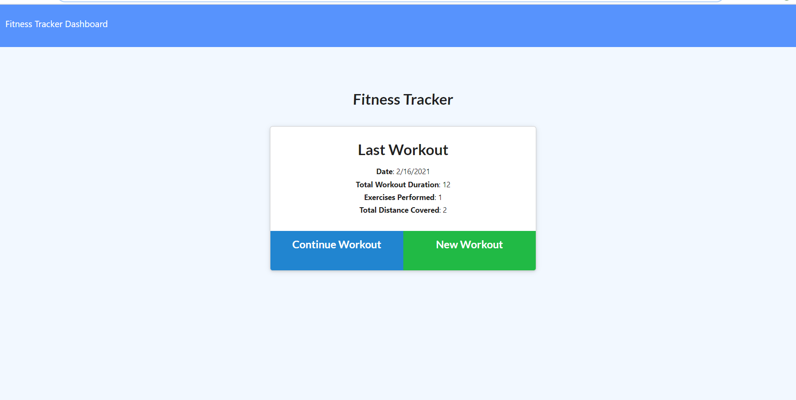
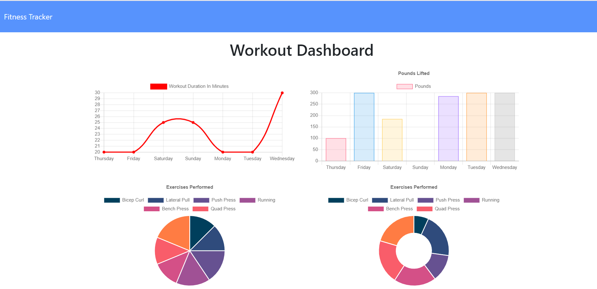

# Workout Tracker
## Description
In this assignment I created a workout tracker. The user will be able to add exercises to the most recent workout plan, add new exercises to a new workout plan. As well as view the combined weight of multiple exercises from the past seven workouts on the `stats` page and view the total duration of each workout from the past seven workouts on the `stats` page.

*https://github.com/AmandaLN/workout_tracker

*https://young-forest-62257.herokuapp.com/

## Technologies
HTML

CSS/Bootstrap

Node.js

NoSQL

Express

MongoDB

Morgan

Moongoose

## Usage

## Maintainer
Amanda Nelson

## License
[MIT](https://choosealicense.com/licenses/mit/)